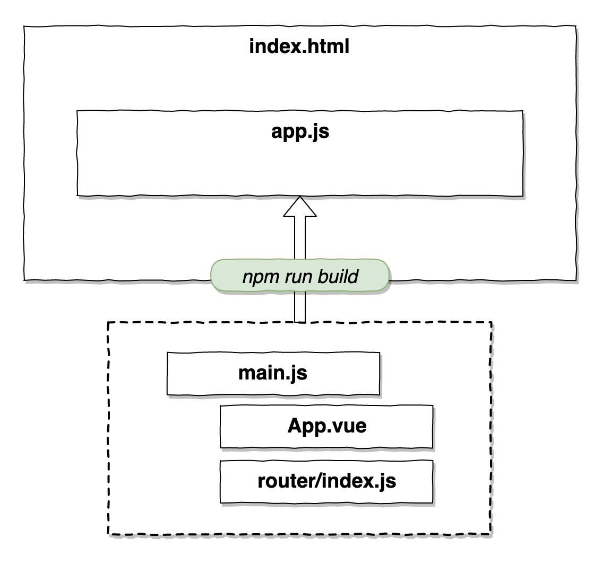
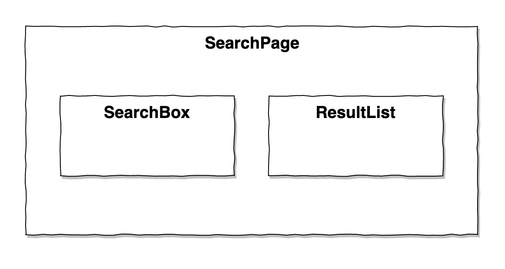
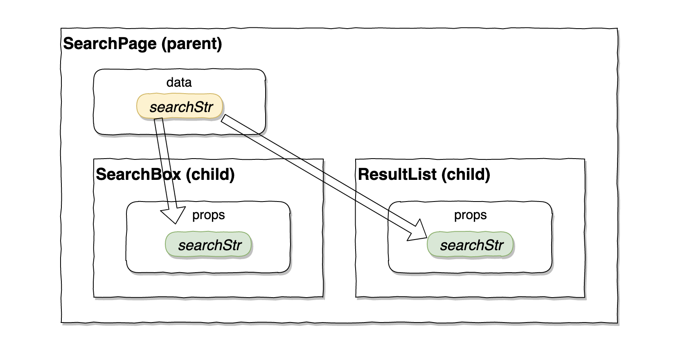
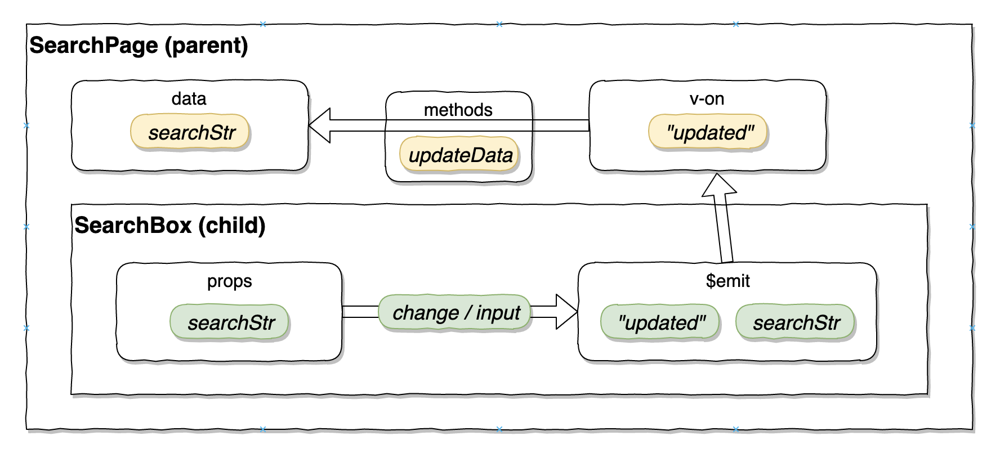
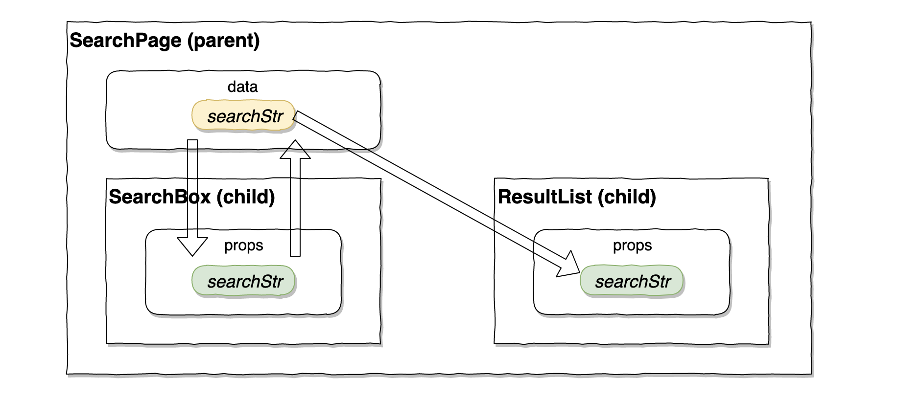

# Vue.js ちゃちゃっと作るハンズオン


---
## 自己紹介
- かわぐちさん

- リードエンジニア＠ウフル
- ずっとDBとかサーバサイドとかやってたけど
- ある日 `SPA` に出会い JavaScript に目覚める
- フランスパンが好き
- チューターをやってくださるのは、はしもとさんとあかまさんです


---
## よろしくお願いしま〜す！


---
## 今日やること
- Vue でちょっとしたアプリケーションをゼロから作る。
  - プロジェクトの作成
  - devサーバのポート変更
  - 画面の追加
  - ルーターリンクを使う
  - コンポーネントの追加
  - 親子でのデータの受け渡し（参照系と更新系）
  - Ajax して SPA らしさを体感
  - 本当は `Vuex` を超超ちょ〜説明したいけど時間の都合上カット(T^T)
- ゴール
  - YouTube Data API v3 に Ajax して動画リスト表示する。


---
## サンプルリポジトリ
- https://github.com/tkawaguchi-uhuru/kawaii-vue-example

- girls 向けに kawaii 感じに（名前だけ）なってます
- このスライドも markdown でリポジトリに入ってます（Marp for VSCode）


---
## 準備
- nodebrew で node v8.9.x~ を用意する

  - お仕事の node 環境を汚さないように！
- 例:
```shell
$ node -v
v10.16.0

$ npm -v
v6.9.0
```


---
## 自習の進め方
- サンプルリポジトリを clone しておく。

- 教科書（本書）で `Repo.` マークのついてる見出しを見つけたら...
- Git タグを探す。
- そのタグから次のタグまでの数コミット分がその単元の内容に相当します。
- ご自身で GCP アカウントを取得して API key を発行して差し替えてください。


---
## あるとはかどる道具類
- node.js + nodebrew

- git
- sourcetree (tag追っかけるのが楽, gitも入ってる)
- VSCode と 拡張機能
  - Vueのシンタックスハイライトできるもの
  - Marp for VSCode


---
## 環境構築


---
## Vue-CLI のインストール
- Vue-CLI を使う。
- グローバルインストールする。
- インストールガイドをざく読み。
  - https://cli.vuejs.org/guide/installation.html
- Vue-CLI は最新を使う。（2.x, 1.x と互換性ない）

```shell
$ npm install -g @vue/cli

...

+ @vue/cli@4.0.5
added 1156 packages from 638 contributors in 68.725s
```


---
## （つづき）
- インストール結果の確認
```shell
$ vue --version
@vue/cli 4.0.5
```


---
## 参考: Node.js 切り替えツール
- Mac: nodebrew
  - https://qiita.com/ucan-lab/items/517ee13a2f8769ab866c
- Windows: nodist
  - https://qiita.com/Futo23/items/0825aa96088c5ff0906b
  - 以前別のハンズオンで nvm-windows でハマったことがあったので nodist を紹介


---
## プロジェクトの作成


---
## Vue プロジェクトの作成
- Vue-CLI のコマンドでプロジェクトを作成
- ウィザード形式でいくつかの質問に答えると、プロジェクトスケルトンが作られる
- 作成コマンド:
```shell
$ vue create kawaii-vue
```


---
## （つづき） ウィザードに答えていく
- 今回はこのように選択:
  - マニュアル選択で router と CSSプリプロセッサ を追加
    - 上下で移動、スペースで選択/解除、Enterで決定
  - router の history モードを Yes
  - CSSプリプロセッサのエンジンを SCSS(node-sass) を選択
  - JS の Lint 設定は Standard を選択
  - Lint on save
  - Babel などの設定ファイルを package.json に含めるか？(dedicated)
  - この設定を次回以降のために保存するか？ (No)
- これでプロジェクトが出来上がりました。
- 説明の通りに cd して devサーバ を起動してみましょう。


---
## （つづき） devサーバを起動
```shell
$ cd kawaii-vue
$ npm run serve

...

  App running at:
  - Local:   http://localhost:8080/
  - Network: http://192.168.0.10:8080/

...
```


---
## （つづき） ポートの変更 `repo.`
- デフォルトの動作で http://localhost:8080 で起動しています。
- PCや社内LANの制約で :8080 が使えない場合はポート変更が必要です。
- プロジェクト root に vue.config.js というファイルを追加します。
  - このファイルが存在していれば起動時に自動的に読み込まれます。
  - https://cli.vuejs.org/config/#vue-config-js
```javascript=
// vue.config.js

module.exports = {
  devServer: {
    port: 8888, // 任意のポートに変更する。ここでは 8888
    disableHostCheck: true // 社内プロキシなどある場合は必要になる
  }
}
```


---
## （つづき） ポートが変更されてることを確認
- もう一度
```shell
$ npm run serve

...

  App running at:
  - Local:   http://localhost:8888/
  - Network: http://192.168.0.10:8888/

...
```
- http://localhost:8888 で起動しています。
- Chrome でみてみましょう。
- Good!


---
## プロジェクトの中身を少しだけみてみる
- public/index.html
  - 唯一の html。ここの `<div id="app">` に
  - app.js が差し込まれ全てのVueが動く起点となる。
- src/main.js
  - js のエントリポイント
  - 全ての .vue, .js ファイルが集まって app.js に化ける。
- src/App.vue
  - 最上階層の .vue ファイル
- src.router/index.js
  - ルーター。URLパスとコンポーネントを結びづける。
  - Rails の routes.rb みたいなもの。
  - なんかコメント書いてある。あとで説明するかも。しないかも。


---



---
## ベースのCSS追加しておく `repo.`
- App.vue にベースCSSを追加しておきましょう
- normalize.css を npm インストールする
```shell
$ npm i normalize.css -D
```
- リポジトリからコードをコピペ
- SCSS で書いてます
- FLOCSS 使ってます
- このへん、今日は説明を省略しますが
  - 学びたい方は、ぜひ `はしもとさん` と語り合ってください。


---
## 画面を作っていきます


---
## ページを追加してみる `repo.`
- MenuPage
  - ページの .vue と router を追加
  - 動作確認: http://localhost:8888/menu
- では SearchPage の追加もやってみましょう。
  - ページの .vue と router を追加して
  - 動作確認: http://localhost:8888/search
- 簡単ですね！
- 解説:
  - history モードと hash モードを調べてみてね。
  - https://router.vuejs.org/ja/guide/essentials/history-mode.html


---
## 画面遷移を作る `repo.`
- route-link を使ってみる。

- App.vue に書いてあったのでまんまパクる。
- Home の書きっぷりをそのままコピーする。
- 動作確認。
- 超簡単っすね。


---
## （つづき） router-link / vue-router
- 解説:
  - https://router.vuejs.org/ja/api/#router-link-props
  - 今回は最もシンプルな to の `文字列指定` を用いました。
  - router-link は vue-router の機能です。
  - vue-router には他にも読めば納得する機能が盛りだくさんです。
  - vue で実案件をやっていくと徐々に高度な要求が出てくるのですが、今まで使っていなかった router 機能を掘り起こして使うことになります。
  - すぐに get/post パラメータを受け取って画面に渡す機能にお世話になるでしょう。
    - https://router.vuejs.org/ja/guide/essentials/dynamic-matching.html
  - 公式ドキュメントを読みながら試してみてください。


---
## コンポーネント / データバインド


---
## コンポーネントの構成



---
## サブコンポーネントを追加してみる `repo.`
- 検索画面に 検索UI と 結果リスト を追加する。

- src/components/ に SearchBox.vue を追加
- SearchPage.vue を修正する。
  - `<script>` でコンポーネントのファイルを読み込んで
  - components で使えるように定義して
  - `<template>` 側で `<search-box>` と書く。
  - これでコンポーネントが読み込まれます。


---
## （つづき） 
- ResultList.vue も同様にやってみてください。

- 簡単ですね！
- 解説:
  - kebab-case に注意すること。
  - https://jp.vuejs.org/v2/style-guide/index.html#%E3%83%86%E3%83%B3%E3%83%97%E3%83%AC%E3%83%BC%E3%83%88%E5%86%85%E3%81%A7%E3%81%AE%E3%82%B3%E3%83%B3%E3%83%9D%E3%83%BC%E3%83%8D%E3%83%B3%E3%83%88%E5%90%8D%E3%81%AE%E5%BD%A2%E5%BC%8F-%E5%BC%B7%E3%81%8F%E6%8E%A8%E5%A5%A8


---
## コンポーネントにもCSSを追加しておく `repo.`
- SearchBox.vue, ResultList.vue とも
- リポジトリから `<style>` 要素をコピペ
- 各要素にそれぞれ class を振っていく
- 必要であれば要素を追加する


---
## 検索Boxの中でデータバインド `repo.`
- SearchBox.vue を修正する。

##### コンポーネントに検索文字列用のデータを定義する
```javascript
export default {
  data () {
    return {
      // ここにコンポーネントのローカルデータを書いていく
      searchStr: 'ほげ'
    }
  }
  ...
```


---
## （つづき）
##### <template> 側でデータ参照する
- `v-model` でデータバインド
  - `v-model` は二つのことをやってくれてる
  - ローカルデータ -> 画面表示の時に参照
  - 画面での変更 -> データ更新
  - 内部では v-bind と v-on の二つが動いてるだけ
```html
<template>
  <div>
    <input type="search" v-model="searchStr">
  </div>
</template>
```


---
## 結果リストの中でデータバインド `repo.`
- ResultList.vue を修正する
##### dummyData を定義する
```javascript
export default {
  data () {
      return {
        // ここにコンポーネントのローカルデータを書いていく
        dummyData: [
          { id: 0, title: 'データ1', body: 'データ1の内容です。123' },
          { id: 1, title: 'データ2', body: 'データ2の内容です。456' },
          { id: 2, title: 'データ3', body: 'データ3の内容です。789' }
        ]
      }
    }
  ...
```


---
## （つづき）
##### <template> でデータを利用する
- v-for でループ処理。この例だと `<li>` が n個 出現する。
- v-for には v-bind:key の指定が必須。key の値は重複してはダメ。
- `v-bind:key=` は `:key=` のように省略できる。
  - https://jp.vuejs.org/v2/guide/syntax.html#v-bind-%E7%9C%81%E7%95%A5%E8%A8%98%E6%B3%95
```html
<template>
  <div>
    <ul>
      <li v-for="item in dummyData" :key="item.id">
        <p>{{item.title}}</p> <!-- {{hoge}} テキストの展開 -->
        <p>{{item.body}}</p>
      </li>
    </ul>
  </div>
</template>
```


---
## コンポーネント間のデータの受け渡し


---
## 親 -> 子に渡す（値の参照） `repo.`
- props を使う
- 親の `<template>` 側で子要素を呼び出す際に v-bind で値を注入できる
- 子では受け取り用の変数を props に定義する
- props ではデータ型の指定をする（事実上必須）
```html
  <!-- 親で子要素呼び出し その際にデータ注入 -->
  <result-list :searchStr="searchStr"></result-list>
```
```javascript
  // 子の <script> で props を定義
  props: {
    searchStr: {
      type: String // 型の指定
    }
  }
```


---



---
## 子 -> 親に返す（値の変更） `repo.`
- 子では $emit を使う
- 値が変更されたら $emit('eventName') を用いて親に通知する
- 親では v-on:eventName で待ち受けする（@eventName= で省略可）
- 親が通知を受けたら実行する処理を、親の methods に書いておく
- この場合は `v-model` は使うべきでない
  - props でもらった値は元は親の持ち物なので直接更新してはいけない。
  - 参照系と更新系を２つに分解してそれぞれ記述する


---
## （つづき）
```javascript
  // 子で props を定義
  props: {
    searchStr: {
      type: String
    }
  }
 ...
```
```html
  <!-- 子の template -->
  <input
    type="search"
    :value="searchStr"
    @input="$emit('updated', $event.target.value)" /* $emit で親に通知 */
  >
  <!-- v-model 使わない -->
```


---
## （つづき）
```html
  <!-- 親の template @updated で通知を受付け、メソッドを実行する。 -->
  <search-box :searchStr="searchStr" @updated="updatedEvent"></search-box>
```
```javascript
  // 親 <script>
  data () {
    return {
      searchStr: 'oya'
    }
  },
  methods: {
    updatedEvent (v) {
      this.searchStr = v  // 親のデータを更新するのは親のメソッド
    }
  }
  ...
```


---



---



---
## Ajax する


---
## ダミーデータをやめて Ajax でサーバからデータを取得する `repo.`
- Axios を追加
```shell
$ npm i axios -S
```
- ResultList.vue を修正
  - watch を用いて props.searchStr の変更を監視しておく。
  - 変更があったら Ajax を発火する。
  - Ajax 結果をローカルデータに保存して画面側で参照する。
- ajaxActions.js をリポジトリからコピペ
  - APIへの接続設定をする。
  - async/await で ajax結果を非同期待ちして戻り値を取得する。
  - Ajax戻り値の整形を行う。画面で使うデータ構造に合わせる。


---
## （つづき）
- 解説:
  - 値が変わったことをフックするには watch が使える
  - watchについて: https://jp.vuejs.org/v2/guide/computed.html#%E3%82%A6%E3%82%A9%E3%83%83%E3%83%81%E3%83%A3

- APIキー に呼び出し回数制限があるw
  - みなさん全員が100万回とかアクセスしたら僕が破産します (^o^)
- gapi.client というものもありますが今回は使用しない
  - https://github.com/google/google-api-javascript-client/blob/master/docs/start.md


---
## 体裁を整える
- 元あった Home, About を削除
- router も整理
- `/` を ManuPage.vue に変更する


---


---
## こんな感じになってるとかんせいで〜す (^o^)


---
## おまけ
- なんと Vue UI などというものが。。。ある。。。
- https://qiita.com/ckern/items/8dc619cc271f4c69658a
- 一見便利そうなんだけど
- これに慣れちゃうと裏で動いている npm のエコシステムを活かした開発の流れがあんまり覚えられない
- なので、裏の動きがわかっている人なら使っても良い
- けども、裏の動きわかってるなら Vue UI 使わずにコマンドで良い
- なので、存在意義が。。。微妙。
- お仕事でバリバリ npm, node.js, SPA をやっていきたい人にはおすすめしません。


---
# おしまい
